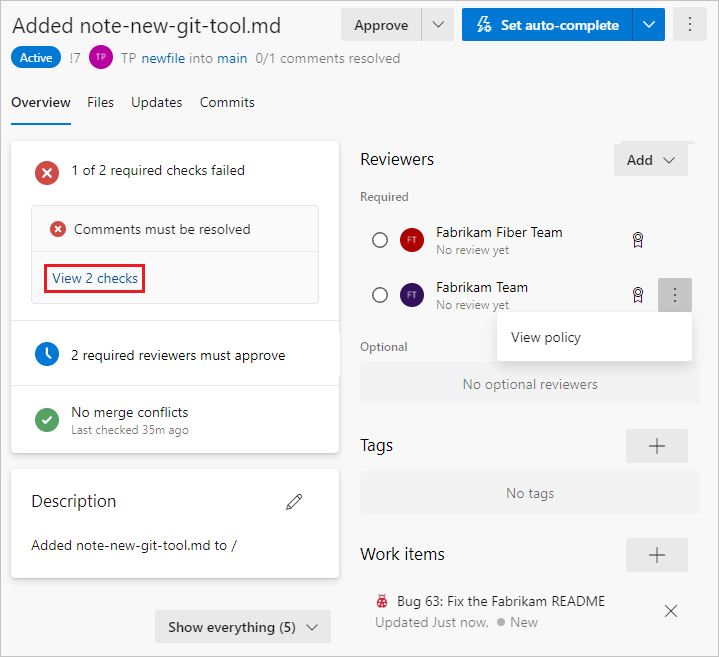

# Giddup reference architecture<!-- omit in toc -->

This repository contains a reference architecture using ports and adapters, domain-driven design (DDD), command query responsibility segregation (CQRS) and event sourcing (ES). It is written in C# using ASP.NET Core as web application framework and EventStore as data store.

## Table of contents<!-- omit in toc -->

- [Getting started](#getting-started)
- [Overview](#overview)
- [Project structure](#project-structure)
- [Acknowledgments](#acknowledgments)
- [References](#references)

## Getting started

Once you have cloned or downloaded the project you can run (and debug) the application using the provided Docker Compose file. The Docker Compose file can be started from Rider or Visual Studio, or you can use the Docker Compose CLI:

```Shell
docker-compose up
```

 By running the Docker Compose file, an EventStore instance is started and the solution is build and started. When the services have started, you can make requests to localhost:5000.

 Sample HTTP requests of all available endpoints are provided in tools/pull-requests.http. The HTTP requests in this file can be executed in Visual Studio Code using the REST Client extension by Huachao Mao [[1]](https://marketplace.visualstudio.com/items?itemName=humao.rest-client "REST Client").

## Overview

Giddup is based on the Azure DevOps pull request user interface, which is a fully task-driven user interface. Task-driven user interfaces usually provide much better user experience and are the cornerstone of CQRS, a task in the user interface translates directly to a command on the server side.



There are all kinds of tasks that can be performed in the Azure DevOps pull request user interface: adding and removing reviewers, linking and removing work items, submitting and resetting reviewer feedback, completing, abandoning and reactivating the pull request and so on. Most of the tasks provided in the Azure DevOps pull request user interface are implemented in Giddup.

TODO: expand on tasks with screenshots

## Project structure

The structure of the solution conforms to the ports and adapters architecture (hexagonal architecture) introduced by Alistair Cockburn [[2]](https://alistair.cockburn.us/hexagonal-architecture/ "Hexagonal architecture") and consists of four projects: presentation, infrastructure, application and domain.

Primary (driving) adapters are implemented in the presentation layer and secondary (driven) adapters are implemented in the infrastructure layer. The application core is divided in the application layer and the domain layer.

TODO: expand on layers with responsibilities  
TODO: expand on decider

## Acknowledgments

* Azure DevOps screenshots used in this document are courtesy of Microsoft.

## References
> - [1] Huachao Mao. [REST Client](https://marketplace.visualstudio.com/items?itemName=humao.rest-client).
> - [2] Alistair Cockburn. [Hexagonal architecture](https://alistair.cockburn.us/hexagonal-architecture/).